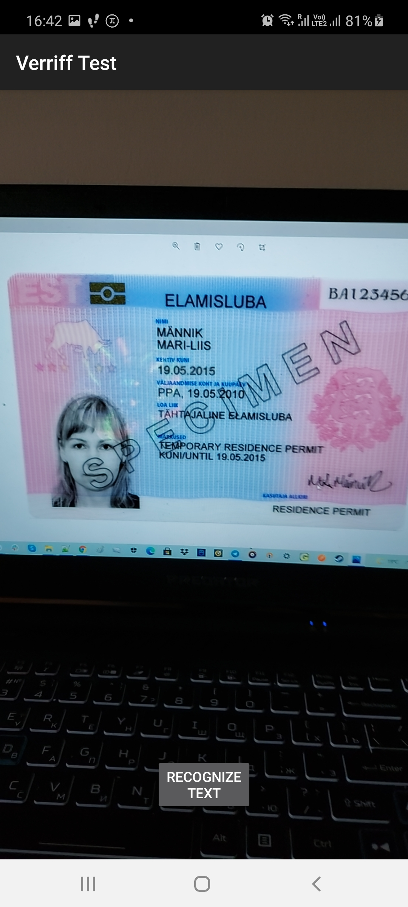

# RecognitionSDK. Home assignment for <a href="https://www.veriff.com/">Veriff</a> made by Stanislav Sobol (stanislav.i.sobol@gmail.com)

## The main SDK goal
The SDK main role is to provide with comfortable functionality of text recognition using the on-board camera.
The SDK takes all the responsibility for making a picture and recognizing its tex blocks if they exist.
The SDK is well documented and is covered by either unit and Espresso tests.
The SDK uses <b>minSdkVersion = 21</b> and <b>targetSdkVersion = 30</b>.

## How to use
1. Insert the SDK dependency row into your app. build.gradle

<code>implementation project(':recognitionSdk')</code>

2. Define the start place and start creating the build-chain of the SDK.

2.1. Start with:

<code>RecognitionSdk</code>

2.2. Add your parent activity in order to start recognition screen e.g.:

<code>withActivityContext(this)</code>

2.3. Add a callback (listener) to receive recognized text blocks e.g.:

<code>setOnSuccessListener{ showTextBlocks(it) }</code>

2.4. If you want to receive error log from the SDK, then add a callback for it e.g.:

<code>setOnErrorListener{ showError(it.message) }}</code>

2.5. Finally, add the a recognition method:

<code>recognizeTextFromCamera()</code>

The entire builder-chain in Kotlin may look like:

<code>

    RecognitionSdk.withActivityContext(this)
        .setOnSuccessListener {
            if (it.isEmpty()) {
                showError(...)
            } else {
                showTextBlocks(it)
            }
         }
        .setOnErrorListener {
            showError(it.message)
        }
        .recognizeTextFromCamera()

</code>

## Host application (example)
The repository also contains a small host application to show how the SDK should be used.
The repository also contains a small host application to show how the SDK should be used.
The SDL starts along with the app. You should see the camera preview screen. After clicking the button
"Recognize text", the SDK starts the recognizing process and returns text blocks if succeded.
In case of empty data or/and in case of error the host app shows the red message and the button "Retry".
You can also retry yourself, in any case, using a slide-to-refresh approach.

## Thd SDK tech stack and dependencies

- Coroutines
- MVVM
- LiveData
- CameraX
- ML-Kit
- Espresso
- JUnit
- Mockito

### Screenshot
